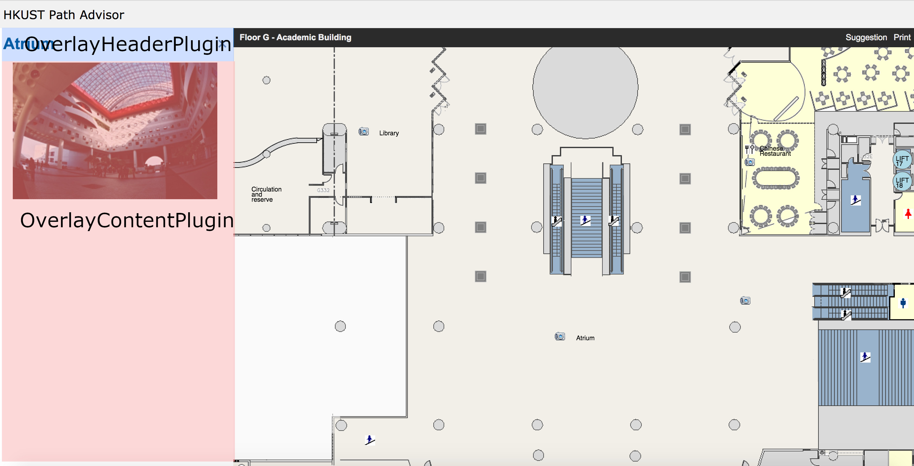
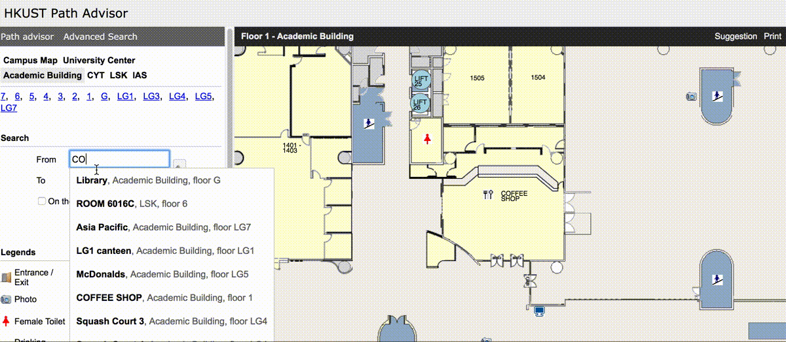

# Introduction

This project is built using [React](https://reactjs.org/) framework. It means building a plugin for this project will just be building a functional react component (a plain javascript function) or if your plugin need to be stateful or you want to control the life cycle of your plugin precisely or to optimize the performance of your plugin, you may want to create a stateful react component (a class extending react component).

There are three types of plugins you can build for this project. They are `PrimaryPanelPlugin`, `MapCanvasPlugin`, `OverlayHeaderPlugin` and `OverlayContentPlugin`. In general, if you want to add new features in map canvas area (drag and drop floor plan area), you will need to build a `MapCanvasPlugin` type plugin. If you want to add features for showing details of a map item on the left UI panel, you will need to build `OverlayHeaderPlugin` and `OverlayContentPlugin`. If you want to add any other features in the left panel of the UI, you will need to build a `PrimaryPanelPlugin` type plugin. It is completely normal that you may need to build more than one of these plugins to complete your feature.




This documentation will cover full details for each of them.

# Plugin structure

## File structure

All plugins will live under the root `plugins` folder and each plugin will have their own folder containing all their assets inside. Inside their own folders, there should be at least one js file which its filename should be the same as the plugin folder's name and this file will be the entry point for the plugin. All plugin folder name should be in camel case.
For example, if you want to build a hello world plugin, you will need to create a folder named `HelloWorld` under plugins folder. Inside `HelloWorld` folder, there should be a `HelloWorld.js` file.

```
...
src
└── plugins/
    └── HelloWorld/
        └──  HelloWorld.js
...
```

Finally, in order to include your plugin, you need to edit `plugins/index.js` file to include `HelloWorld.js` file.

plugins/index.js

```javascript
import * as FooBar from './FooBar/FooBar;
import * as HelloWorld from './HelloWorld/HelloWorld';

export [FooBar, HelloWorld];
```

## Entry point file

The plugin entry point file `HelloWorld.js` will have the following format:

```javascript
const id = "HelloWorld";

function HelloWorldPrimaryPanel() {
  return <h1> Hello World in PrimaryPanel </h1>;
}

function HelloWorldMapCanvas() {
  return <h1> Hello World in MapCanvas </h1>;
}

function HelloWorldOverlayHeaderPlugin() {
  return <h1> Hello World in MapCanvas </h1>;
}

function HelloWorldOverlayContentPlugin() {
  return <h1> Hello World in MapCanvas </h1>;
}

const PrimaryPanelPlugin = { Component: HelloWorldPrimaryPanel, connect: [] };
const MapCanvasPlugin = { Component: HelloWorldMapCanvas, connect: [] };
const OverlayHeaderPlugin = {
  Component: HelloWorldOverlayHeaderPlugin,
  connect: []
};
const OverlayContentPlugin = {
  Component: HelloWorldOverlayContentPlugin,
  connect: []
};

export {
  id,
  PrimaryPanelPlugin,
  MapCanvasPlugin,
  OverlayHeaderPlugin,
  OverlayContentPlugin
};
```

Note that if your plugin only contains `PrimaryPanelPlugin`, you don't need to export all the other types. i.e.

```javascript
const id = "HelloWorld";

function HelloWorld() {
  return <h1> Hello World </h1>;
}

const PrimaryPanelPlugin = { Component: HelloWorld, connect: [] };

export { id, PrimaryPanelPlugin };
```

## Component and connected properties

As shown in previous chapter, each plugin type will be in the following structure:

```javascript
const PrimaryPanelPlugin = { Component: null, connect: [] };
```

There are two keys for a plugin, `Component` and `connect`.

`Component` is the actual plugin component, it can be a plain javascript function or a class extending
[React.Component](https://reactjs.org/docs/glossary.html#components) or [React.PureComponent](https://reactjs.org/docs/react-api.html#reactpurecomponent)

`connect` is an array of property names that will be passed to the Component.

For example, if your component need the current `floor`, `x` and `y` coordinate values, you need to define them in the `connect` array in order to use them in the component.

Note that connected property can be a string, a number or a function. In this case, `floor` is string and `x` and `y` are numbers.

** Functional plugin version **

```javascript
const id = "HelloWorld";

function HelloWorld({ x, y, floor }) {
  return (
    <h1>
      {" "}
      I am now at floor {floor} at ({x},{y}) position{" "}
    </h1>
  );
}

const PrimaryPanelPlugin = {
  Component: HelloWorld,
  connect: ["x", "y", "floor"]
};

export { id, PrimaryPanelPlugin };
```

** Class plugin version **

```javascript
class HelloWorld extends React.Component {
  render() {
    const { x, y, floor } = this.props;
    return (
      <h1>
        {" "}
        I am now at floor {floor} at ({x},{y}) position{" "}
      </h1>
    );
  }
}

const PrimaryPanelPlugin = {
  Component: HelloWorld,
  connect: ["x", "y", "floor"]
};

export { id, PrimaryPanelPlugin };
```

[insert gif for result for this hello world component]

For each plugin type you can connect different types of properties, they are described in [Types of plugin]() section.

## Updating and rendering

Each time the properties that you connected to the plugin component are updated, the plugin function, or the render method of the plugin if you define your plugin as a class, will be called. A property is considered to be updated when it is assigned a value by some external actions, usually triggered by user interaction. But there is no guarantee the assigned value must be different from the old one. One of the examples is that when users input a room number and click search for the first time, property `searchAreaInputStore` will be considered as updated and if your plugin connects to `searchAreaInputStore` property, the plugin function or the render function of the plugin class will be called to re-render. If the user later click search again without changing any input values, `searchAreaInputStore` will be considered to be updated as well and the same re-rendering process will follow. This process can guarantee it captures every user interactions correctly.

Usually this process will be enough for most of the use cases. If for performance reason or any other reason you only want rendering to happen when the actual value of a property changed. You will need to define your plugin as a class and extending from [React.PureComponent](https://reactjs.org/docs/react-api.html#reactpurecomponent) or define a [shouldComponentUpdate](https://reactjs.org/docs/react-component.html#shouldcomponentupdate) method in your React.Component class.

Example:

```javascript
class HelloWorld extends React.Component {
  shouldComponentUpdate(nextProps) {
    return;
    nextProps.searchAreaInputStore.from.name !==
      this.props.searchAreaInputStore.from.name ||
      nextProps.searchAreaInputStore.to.name !==
        this.props.searchAreaInputStore.to.name;
  }

  render() {
    console.log(
      "This message will only be logged if the value from.name and to.name inside object searchAreaInputStore are changed, even if users click search multiple times"
    );
    return null;
  }
}
```

Also if your plugin only exists to call some functions and do not render anything, you must return `null`. An error will be thrown if a plugin does not return anything.

** function plugin **

```javascript
function HelloWorld() {
  console.log("Hello world plugin");
  return null;
}
```

** class plugin **

```javascript
class HelloWorld extends React.Component {
  render() {
    console.log("Hello world plugin");
    return null;
  }
}
```

# Getting started

Until now we discovered different types of plugins and how a basic plugin looks like. Let's start writing a simple plugin for the project.

## Download the project

You will need to install git, node 8.x and npm 5.x.

Newer version of node and npm should also work but not guaranteed.

You can download node from https://nodejs.org/en/ if you don't have one. Installing node from the official package will usually install npm at the same time.

You will need to git clone the project from [insert url].

Go to the project directory and run `npm install` for the first time

Then run `npm start` in the terminal to start the project.

You should able to access path advisor locally now at http://localhost:3000.

## Plugin feature

Imagine the user specified a place in the left panel of the UI in the input field. For example, the user input is Atrium. Now in the map canvas area the system will jump to the position of the atrium. What if we also want to put a pin on top of atrium location?

## Decide which type of plugins

The first thing we need to think about is which [ype of plugins we need to build for this feature. For some features it may require you to write multiple types of plugin to achieve. In this case, we are just putting a pin icon in map canvas area and therefore it only affects the rendering of the map canvas area. So we only need to build a MapCanvasPlugin type plugin.

## Decide what properties you need to connect

In order to put a pin in the user specified location, we will need the property which stores the user input values. This
property is called `searchAreaInputStore`.

Also imagine we need to put a pin in the map area depending on the user input value, or we need to remove a pin if users clear their input value. Therefore we need two more properties `setMapItems` and `removeMapItem` which they are functions to set or remove an item in map canvas area.

This is what we have now for the pin plugin after connect all the required properties:

Pin.js

```javascript
function Pin({ searchAreaInputStore, setMapItems, removeMapItem }) {
  return null;
}

const MapCanvasPlugin = {
  Component: Pin,
  connect: ["searchAreaInputStore", "setMapItems", "removeMapItem"]
};

const id = "Pin";
export { id, MapCanvasPlugin };
```

## Implementing the function

If we look at the plugin type documentation, we can find out `searchAreaInputStore` is an object containing some of the following properties:

```javascript
 {
   from: {
      data: {
        coordinates: [Number, Number]
      },
    floor: String
   },
  /* and more properties ... */
 }
```

The `[x, y]` coordinates and `floor` will be updated in this object every time when the users update their input values.

Also the `setMapItems` function takes an array of object with the following format:

```javascript
{
  id: String,
  floor: String,
  x: Number,
  y: Number,
  image: HTMLImageElement,
  /* and more properties ... */
}
```

Calling `setMapItems` multiple times with same `id` for an object will update its data but not duplicating several items with the same `id`. So it is a function to create a new or updating an existing item in map canvas.

`removeMapItems` just will take an id where the id is the item to be removed from the map canvas area. Removing an non existing item will do nothing.

Now in terms of function and data, we have everything we need already. The only thing that is missing is the pin image.
Let's put the pin image to the plugin folder and import it. We can use script to determine the image's width and height but since it is a static image it would be just simpler and quicker to define these values right away.


```javascript
import pinImage from "./pin.png";

const pinImageWidth = 9;
const pinImageHeight = 20;

const image = new Image();
image.src = pinImage;
```

Now inside the plugin function, we can say if `x`, `y` and `floor` are defined, we will call `setMapItems` to put the pin in map canvas otherwise we will call `removeMapItem` to remove it from map canvas. The function will be called every time the connected properties are updated. So whenever the user updated its input, the pin will be updated as well. Also remember to return null as we are not rendering any HTML elements in this plugin, we only instruct map canvas to add one more item only.

```javascript
function Pin({ setMapItems, removeMapItem, searchAreaInputStore }) {
  // Getting required values from searchAreaInputStore
  const {
    from: {
      data: { coordinates: [x, y] = [null, null], floor = null } = {}
    } = {}
  } = searchAreaInputStore || {};

  const PIN_ID = "PIN_ID";

  if (x && y && floor) {
    // Putting a pin in map canvas if x, y and floor are defined
    setMapItems([
      {
        id: PIN_ID,
        floor,
        x: x - pinImageWidth / 2, // center the pin image horizontally
        y: y - pinImageHeight, // the bottom of the pin should point at the y
        image
      }
    ]);
  } else {
    // otherwise remove
    removeMapItem(PIN_ID);
  }

  // A react component need to return null if it is not returning any node
  return null;
}

const MapCanvasPlugin = {
  Component: Pin,
  connect: ["searchAreaInputStore", "setMapItems", "removeMapItem"]
};

const id = "Pin";
export { id, MapCanvasPlugin };
```

Don't forget to update `plugins/index.js` to include this new plugin.

```javascript
import * as SomeOtherPlugin from "./SomeOtherPlugin/SomeOtherPlugin";
import * as Pin from "./Pin/Pin";

export default [SomeOtherPlugin, Pin];
```

And now you should able to see a pin set in the map canvas area every time when you input a location.



# Types of plugin

##

# Advanced topics

## Optimization

## Orders of executing

## Import assets

# More Examples
