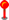
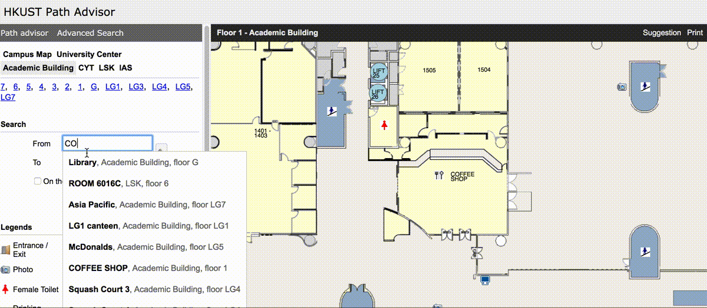

# Getting started

## Download the project

You will need to install git, node 8.x and npm 5.x.

Newer version of node and npm should also work but not guaranteed.

You can download node from https://nodejs.org/en/ if you don't have one. Installing node from the official package will usually install npm at the same time.

You will need to git clone the project from https://gitlab.com/thenrikie/pathadvisor-frontend.

Go to the project directory and run `npx bolt` for the first time. It will install all dependencies for the project and for all the plugins.

Then run `npm start` in the terminal to start the project.

You should able to access path advisor locally now at http://localhost:3000.


## Plugin feature

We want to put a pin at the location after user has input a specified location in the left panel of the UI in the input field. For example, if the user has input Atrium in the input field, the map canvas area will now jump to the position of the atrium. What if we also want to put a pin on top of atrium location?

## Bootstrapping

Let first called this plugin `Pin` and create a folder named `Pin` in plugins folders.

Also create an empty `Pin.js` file for now and a `package.json` file with the following content.

package.json
```json
{
  "name": "@ust-pathadvisor/pin",
  "version": "0.0.0",
  "private": true
}
```

We should now the the following file structure:

```
src
└── plugins/
    └── Pin/
        ├──  package.json
        └──  Pin.js
```

## Decide which type of plugins

The first thing we need to think about is which [ype of plugins we need to build for this feature. For some features it may require you to write multiple types of plugin to achieve. In this case, we are just putting a pin icon in map canvas area and therefore it only affects the rendering of the map canvas area. So we only need to build a `MapCanvasPlugin` type plugin. You can find all types of plugin in [Plugin structure](pluginStructure/README.md) section.

## Decide what properties you need to connect

In order to put a pin in the user specified location, we will need the property which stores the user input values. This property is called `from`. You can find all available properties for different type of plugins in [Types of plugins](typesOfPlugins/README.md) section.

Also imagine we need to put a pin in the map area depending on the user input value, or we need to remove a pin if users clear their input value. Therefore we need two more properties `setMapItems` and `removeMapItem` which they are functions to set or remove an item in map canvas area.

This is what we have now for the pin plugin after connect all the required properties:

Pin.js

```javascript
function Pin({ from, setMapItems, removeMapItem }) {
  return null;
}

const MapCanvasPlugin = {
  Component: Pin,
  connect: ["from", "setMapItems", "removeMapItem"]
};

const id = "Pin";
export { id, MapCanvasPlugin };
```

## Implementing the function

If we look at the plugin type documentation, we can find out `from` is an object containing some of the following properties:

```javascript
 {
   data: {
     coordinates: [Number, Number],
     floor: String
     /* and more properties ... */
   }
 }
```

The `[x, y]` coordinates and `floor` will be updated every time when the users update their input values.

Also the `setMapItems` function takes an array of object with the following format:

```javascript
{
  id: String,
  floor: String,
  x: Number,
  y: Number,
  image: HTMLImageElement,
  /* and more properties ... */
}
```

Calling `setMapItems` multiple times with same `id` for an object will update its data but not duplicating several items with the same `id`. So it is a function to create a new or updating an existing item in map canvas.

`removeMapItems` just will take an id where the id is the item to be removed from the map canvas area. Removing an non existing item will do nothing.

Now in terms of function and data, we have everything we need already. The only thing that is missing is the pin image.
Let's put the pin image to the plugin folder and import it. We can use script to determine the image's width and height but since it is a static image it would be just simpler and quicker to define these values right away.



```javascript
import pinImage from "./pin.png";

const pinImageWidth = 9;
const pinImageHeight = 20;

const image = new Image();
image.src = pinImage;
```

Now inside the plugin function, we can say if `x`, `y` and `floor` are defined, we will call `setMapItems` to put the pin in map canvas otherwise we will call `removeMapItem` to remove it from map canvas. The function will be called every time the connected properties are updated. So whenever the user updated its input, the pin will be updated as well. Also remember to return null as we are not rendering any HTML elements in this plugin, we only instruct map canvas to add one more item only.

Pin.js
```javascript
function Pin({ setMapItems, removeMapItem, from }) {
  // Getting required values from from
  const { data: { coordinates: [x, y] = [null, null], floor = null } = {} } = from;

  const PIN_ID = "PIN_ID";

  if (x && y && floor) {
    // Putting a pin in map canvas if x, y and floor are defined
    setMapItems([
      {
        id: PIN_ID,
        floor,
        x: x - pinImageWidth / 2, // center the pin image horizontally
        y: y - pinImageHeight, // the bottom of the pin should point at the y
        image
      }
    ]);
  } else {
    // otherwise remove
    removeMapItem(PIN_ID);
  }

  // A react component need to return null if it is not returning any node
  return null;
}

const MapCanvasPlugin = {
  Component: Pin,
  connect: ["from", "setMapItems", "removeMapItem"]
};

const id = "Pin";
export { id, MapCanvasPlugin };
```

Don't forget to update `plugins/index.js` to include this new plugin.

```javascript
import * as SomeOtherPlugin from "./SomeOtherPlugin/SomeOtherPlugin";
import * as Pin from "./Pin/Pin";

export default [SomeOtherPlugin, Pin];
```

And now you should able to see a pin set in the map canvas area every time when you input a location.


