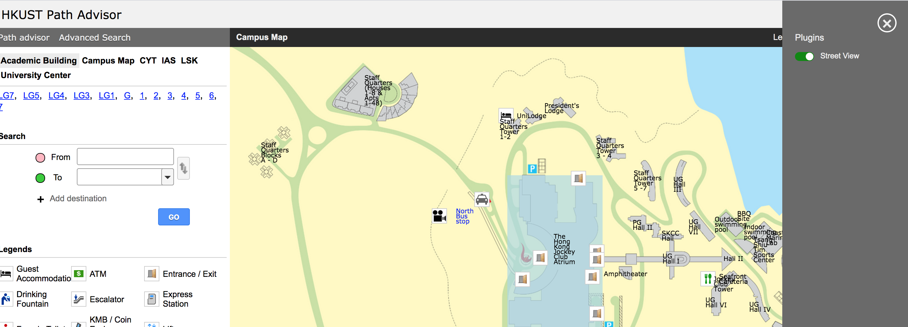

# Plugin structure

## File structure

All plugins lives under the root `plugins` folder and each plugin will have their own folder containing all their assets inside. Inside their own folders, there should be at least one `.js` file which its filename should be the same as the plugin folder's name and one other file named `package.json` defining this plugin's name and dependencies. All plugin folder name should be in camel case.
For example, if you want to build a hello world plugin, you will need to create a folder named `HelloWorld` under plugins folder. Inside `HelloWorld` folder, there should be a `HelloWorld.js` and a `package.json` file.

```
...
src
└── plugins/
    └── HelloWorld/
        ├──  package.json
        └──  HelloWorld.js
...
```

Finally, in order to include your plugin, you need to edit `plugins/index.js` file to include `HelloWorld.js` file.

plugins/index.js

```javascript
import * as FooBar from './FooBar/FooBar';
import * as HelloWorld from './HelloWorld/HelloWorld';

export [FooBar, HelloWorld];
```


## Package.json

The full specification of a package.json can be found here [https://docs.npmjs.com/files/package.json](https://docs.npmjs.com/files/package.json)

Your plugin `package.json` should include at least the following content.

```json
{
  "name": "@ust-pathadvisor/my-first-plugin",
  "version": "0.0.0",
  "private": true
}
```

The `name` field should always starts with `@ust-pathadvisor/` followed by your plugin name in kebab case (lower case and words separated by dash) format.


You can use libraries found from http://npmjs.com repo and import them to use in your plugin, but you must define these dependencies in `package.json` file so that the build script know what libraries to be included during build time.

If you plugin, for example, want to use the library [lodash.get](https://www.npmjs.com/package/lodash.get), you can run the command in project directory `npx bolt w @ust-pathadvisor/my-first-plugin add lodash.get`.

After running the command, it will update your plugin's `package.json` automatically with the following content.

```json
{
  "name": "@ust-pathadvisor/my-first-plugin",
  "version": "0.0.0",
  "private": true,
  "dependencies": {
    "lodash.get": "^4.4.2"
  }
}
```

and then you can start using this library in your plugin:

```javascript
import get from 'lodash.get';
```

## Entry point file

The plugin entry point file `HelloWorld.js` will have the following format:

```javascript

function HelloWorldPrimaryPanel() {
  return <h1> Hello World in PrimaryPanel </h1>;
}

function HelloWorldMapCanvas() {
  return <h1> Hello World in MapCanvas </h1>;
}

function HelloWorldOverlayHeader() {
  return <h1> Hello World in MapCanvas </h1>;
}

function HelloWorldOverlayContent() {
  return <h1> Hello World in MapCanvas </h1>;
}

const PrimaryPanelPlugin = { Component: HelloWorldPrimaryPanel, connect: [] };
const MapCanvasPlugin = { Component: HelloWorldMapCanvas, connect: [] };
const OverlayHeaderPlugin = { Component: HelloWorldOverlayHeader, connect: [] };
const OverlayContentPlugin = { Component: HelloWorldOverlayContent, connect: [] };

const id = "helloWorld";
const name = "Hello World";
const defaultOff = true;
const platform = ['DESKTOP'];
const core = false;

export {
  id,
  name,
  defaultOff,
  platform,
  core,
  PrimaryPanelPlugin,
  MapCanvasPlugin,
  OverlayHeaderPlugin,
  OverlayContentPlugin
};
```

Basically there are four different types of plugin you can define, you can find the document for each type [here](typesOfPlugins/README.md).
Note that you also need to define `id`, `name` and `defaultOff` for your plugin and exports them.

`id` - Unique id for your plugin.

`name` - The name of your plugin. It will be used to identify your plugin in plugin toggle panel.

`defaultOff` - Boolean value to define whether your plugin will be off by default, the users can switch it on and off in the plugin toggle panel, default to true if not provided.

`platform` - An array of platforms your plugin supports. Default to all platforms. Available value for platform item is DESKTOP, MOBILE.

`core` - Reserved to ITSC pathadvisor team and default to false. Third party plugin must not set this property to true. Core plugin ignore defaultOff and won't be shown in toggle plugin panel as they can't be switched off.


_Plugin toggle panel showing the on/off status of the plugins_


Note that if your plugin only contains `PrimaryPanelPlugin`, you don't need to export all the other types. i.e.

```javascript
function HelloWorld() {
  return <h1> Hello World </h1>;
}

const PrimaryPanelPlugin = { Component: HelloWorld, connect: [] };

const id = "helloWorld";
const name = "Hello World";
const defaultOff = true;

export { id, name, defaultOff, PrimaryPanelPlugin };
```

## Component and connected properties

As shown in previous chapter, each plugin type will be in the following structure:

```javascript
const PrimaryPanelPlugin = { Component: null, connect: [] };
```

There are two keys for a plugin, `Component` and `connect`.

`Component` is the actual plugin component, it can be a plain javascript function or a class extending
[React.Component](https://reactjs.org/docs/glossary.html#components) or [React.PureComponent](https://reactjs.org/docs/react-api.html#reactpurecomponent)

`connect` is an array of property names that will be passed to the Component.

For example, if your component need the current `floor`, `x` and `y` coordinate values, you need to define them in the `connect` array in order to use them in the component.

Note that connected property can be a string, a number or a function. In this case, `floor` is string and `x` and `y` are numbers.

For `OverlayHeaderPlugin` and `OverlayContentPlugin`, the connect array will be ignored. They will always receive four fixed properties: `name`, `photo`, `url` and `others`.

** Functional plugin version **

```javascript
function HelloWorld({ x, y, floor }) {
  return (
    <h1>
      I am now at floor {floor} at ({x},{y}) position.
    </h1>
  );
}

const PrimaryPanelPlugin = {
  Component: HelloWorld,
  connect: ["x", "y", "floor"]
};

const id = "helloWorld";
const name = "Hello World";
const defaultOff = true;

export { id, name, defaultOff, PrimaryPanelPlugin };
```

** Class plugin version **

```javascript
class HelloWorld extends React.Component {
  render() {
    const { x, y, floor } = this.props;
    return (
      <h1>
        I am now at floor {floor} at ({x},{y}) position.
      </h1>
    );
  }
}

const PrimaryPanelPlugin = {
  Component: HelloWorld,
  connect: ["x", "y", "floor"]
};


const id = "helloWorld";
const name = "Hello World";
const defaultOff = true;


export { id, name, defaultOff, PrimaryPanelPlugin };
```

For each plugin type you can connect different types of properties, they are described in [Types of plugin]() section.

## Updating and rendering

Each time the properties connecting to the plugin component are updated, the plugin function, or the render method of the plugin if you define your plugin as a class, will be called.

Also if your plugin only exists to call some functions and do not render any HTML DOM elements and therefore there is nothing to return then you must return `null`. An error will be thrown if a plugin does not return anything.

** function plugin **

```javascript
function HelloWorld() {
  console.log("Hello world plugin");
  return null;
}
```

** class plugin **

```javascript
class HelloWorld extends React.Component {
  render() {
    console.log("Hello world plugin");
    return null;
  }
}
```

For `MapCanvasPlugin`, the items added to map canvas by calling `setMapItems`, they are not HTML DOM elements as these map items are drawn to map canvas directly. For those plugins you should return null as well unless your are returning some extra HTML DOM elements to be rendered on top of the map canvas.

The rule of thumb is your plugin should always have a return statement returning something.